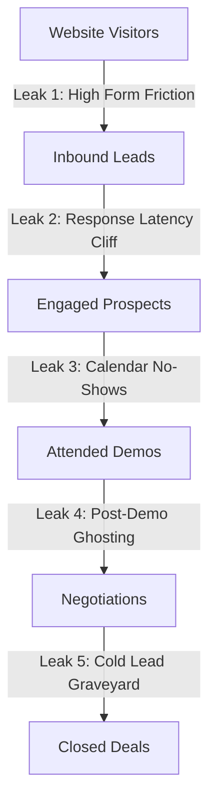

## The Illusion of the Traffic Problem

When revenue plateaus, most CEOs, marketing directors, and agency owners have a predictable reaction:

> *"We need more traffic. Let's double our Google Ads spend, hire an SEO agency, or launch 50,000 cold emails."*

Pouring more traffic into a broken sales process is like turning on the fire hose to fill a bucket full of holes. 

You spend $10,000 to drive 2,000 visitors to your website. 50 people fill out a form. 8 book a discovery call. 5 actually show up. 1 buys. 

You end up paying **$10,000 for a single customer**. 

The problem was never traffic. The problem is that **90% of your sales pipeline is leaking out through invisible operational cracks** before your sales team even has a chance to present your offer.

If you fix the leaks, you can double or triple your revenue from the exact same visitor volume you have right now.

Here are the 5 invisible leaks draining your sales funnel and the exact systems needed to patch them.

---

## The 5 Invisible Funnel Leaks (And How to Patch Them)

---

### Leak #1: High Friction at the Point of Capture
* **The Symptom:** High website traffic, but fewer than 2% of visitors fill out your contact form.
* **The Root Cause:** You are asking for too much information upfront. Forcing prospects to answer 12 mandatory dropdowns (company revenue, number of employees, project budget, phone number, physical address) triggers high psychological resistance.
* **The Fix:** Move to a **two-step conversational capture**:
  1. Ask only for their First Name, Email, and Phone Number on the initial page.
  2. The moment they hit submit, trigger an instant conversational qualification via [ReplyFlow](https://www.replyflow.pro).
  3. Gather the remaining firmographic data (budget, timeline, team size) through a smooth 2-question dialogue via SMS or interactive chat.
* **The Impact:** Lead capture rates typically jump from 1.8% to **5.2%** immediately.

---

### Leak #2: The Response Latency Cliff (The #1 Revenue Killer)
* **The Symptom:** You generate 100 inbound leads, but your sales reps can only get 12 of them on the phone.
* **The Root Cause:** Your team takes an average of 2 to 4 hours to reply. By that time, your prospect has left your website, gone into an internal meeting, or signed up with a competitor who answered first. As documented in our [speed to lead benchmarks](/blog/speed-to-lead-statistics-benchmarks-2026), conversion rates decline by over **80%** after just 30 minutes of delay.
* **The Fix:** Deploy an autonomous response engine that engages leads in **under 90 seconds** across SMS, email, and live messaging.
* **The Impact:** Contact rates jump from 15% to **60%+**, quadrupling discovery call bookings without extra ad spend.

---

### Leak #3: The Calendar No-Show Black Hole
* **The Symptom:** Leads book a discovery call on your Calendly link, but **30% to 50% of them never show up** on Zoom.
* **The Root Cause:** Long booking gaps and lifeless confirmation emails. If a prospect books a call 4 days out and only receives a generic Google Calendar invite, they lose context and prioritize other emergencies.
* **The Fix: The 3-Touch Pre-Call Priming Sequence:**
  * **Immediate Confirmation (Minute 1):** SMS with a personal welcome video from the founder or account executive.
  * **24 Hours Before:** An email teardown of a relevant case study: *"Before we speak tomorrow, here is how we solved this exact problem for [Similar Client]."*
  * **1 Hour Before:** A direct SMS asking for a micro-confirmation: *"Hey [Name], our Growth Director is preparing your account audit for 2 PM. Are we still good for our Zoom link?"*
* **The Impact:** Discovery call show-up rates increase from 55% to **88%+**.

---

### Leak #4: Post-Demo Ghosting & Stalled Proposals
* **The Symptom:** You deliver a great 45-minute demo, send a proposal, and then... absolute radio silence.
* **The Root Cause:** Lack of structured, multi-touch follow-up. 44% of sales reps abandon follow-up after just one email. High-ticket buyers require between 5 and 7 touchpoints before signing.
* **The Fix:** An automated post-demo nurture cadence that alternates between:
  * Overcoming specific implementation fears.
  * Sharing ROI calculators.
  * Triggering the Dean Jackson "Nine-Word Re-engagement" if they stop replying.
  * (Use our copy-paste templates in [High-Converting Lead Nurture Email Sequences](/blog/lead-nurture-email-sequences-templates)).
* **The Impact:** Proposal closing rates increase by **25% to 40%**.

---

### Leak #5: The CRM Lead Graveyard
* **The Symptom:** Your CRM contains 2,000 to 10,000 past leads, form fills, and past clients who haven't spoken to you in 6 to 18 months.
* **The Root Cause:** Sales teams exclusively chase "fresh" leads, treating anyone older than 30 days as dead trash.
* **The Fix: Automated Database Reactivation.** 
  Launch an autonomous reactivation sequence using [ReplyFlow](https://www.replyflow.pro) to send conversational check-ins to cold contacts:
  > *"Hey [First Name], are you still looking to automate your inbound lead follow-up and scale pipeline this quarter, or did you solve that already?"*
* **The Impact:** An immediate 3% to 6% reactivation rate. On a database of 2,000 old leads, that is **60 to 120 warm conversations** with zero ad spend. For the full blueprint, review our [Dead Lead Reactivation Campaign Guide](/blog/dead-lead-reactivation-campaign-guide).

---

## The Funnel Multiplier Effect

Look at how small optimizations across all 5 leaks compound into exponential revenue growth:

| Funnel Stage | Leaky Baseline Funnel | Optimized Autonomous Funnel | Multiplier |
| :--- | :--- | :--- | :--- |
| **Website Visitors** | 10,000 | 10,000 | 1.0x |
| **Form Submissions (Capture)** | 200 (2.0%) | 450 (4.5%) | **2.25x** |
| **Response Time** | 3.5 Hours | **75 Seconds** | **Fast** |
| **Discovery Calls Booked** | 24 (12%) | 157 (35%) | **6.5x** |
| **Call Show-Up Rate** | 13 (55%) | 138 (88%) | **10.6x** |
| **Deals Closed (20% close rate)**| **2.6 Deals** | **27.6 Deals** | **10.6x** |
| **Revenue ($3,000 Retainer)** | **$7,800** | **$82,800** | **10.6x** |

**The math doesn't lie:** By patching response latency, capture friction, and show-up rates, you generate **10x more revenue** from the exact same web traffic.

---

## Action Checklist: How to Patch Your Leaks This Week

1. **Test your own funnel:** Fill out your own form as a secret shopper. Time how long it takes to receive a human or automated reply.
2. **Shorten forms:** Remove unnecessary fields and replace them with post-capture conversational qualification.
3. **Deploy 90-Second Automation:** Integrate [ReplyFlow](https://www.replyflow.pro) with your website and CRM to engage leads instantly.
4. **Implement Show-Up Priming:** Set up automated SMS + case study emails 24 hours and 1 hour before scheduled calls.
5. **Reactivate Your Database:** Don't let old leads rot in your CRM. Run an automated reactivation sprint every 90 days.

Stop spending thousands of dollars feeding a leaky bucket. Patch the leaks, streamline your pipeline, and turn your website into an automated revenue engine.

---

### Related Growth Playbooks
* [Why Most Businesses Fail Even with High Traffic](/blog/why-most-businesses-fail-with-high-traffic)
* [Speed to Lead Statistics & Benchmarks for 2026](/blog/speed-to-lead-statistics-benchmarks-2026)
* [How to Increase Inbound Lead Conversion Rate: The 90-Second Playbook](/blog/how-to-increase-lead-conversion-rate)
* [Dead Lead Reactivation Campaign Guide: Revive Cold Leads](/blog/dead-lead-reactivation-campaign-guide)
* [How to Automate Your Sales Process in 2026](/blog/how-to-automate-sales-process)

