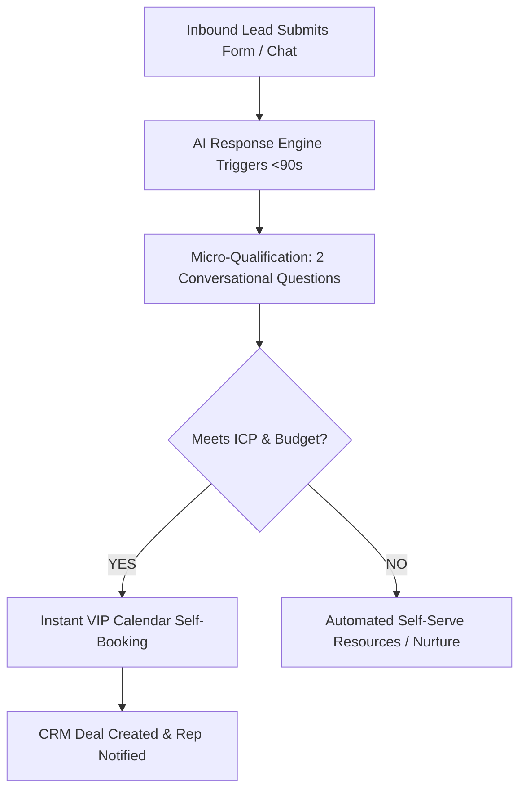

## The Hidden Cost of Unqualified Sales Calls

If you ask most sales leaders or agency founders what their biggest operational bottleneck is, they almost always give the wrong answer.

They say: *"We need more leads."*

Then you look closely at their calendar. Their reps or founders are booked solid with 25 to 40 discovery calls every single week. They spend 30 minutes listening to a prospect describe problems, only to discover at minute 28 that:

1. The prospect has a budget of $200 for a $5,000 service.
2. The person on the phone is a junior intern who has zero purchasing authority.
3. They are looking for a completely different software solution they misidentified on Google.
4. They are "just researching for next year" with no intention of buying anytime soon.

This is the **unqualified calendar trap**. 

When your sales team spends 60% of their day talking to unqualified prospects, two catastrophic things happen simultaneously:

* **Your team burns out:** High-volume rejection and awkward budget mismatch conversations drain sales reps' morale.
* **Your best prospects slip away:** While your reps are stuck on a 45-minute call with a tire-kicker, a genuine enterprise decision-maker who filled out your contact form is waiting for a reply. By the time someone reaches out 3 hours later, they have already signed with a competitor who answered first.

To build a high-performance revenue engine, you do not need more random calls on your calendar. You need an **inbound lead qualification framework** that filters out low-intent prospects instantly and routes qualified buyers directly to your calendar in under 90 seconds.

Here is how modern revenue teams qualify inbound leads in 2026.

---

## Why Traditional Qualification Frameworks Are Broken in 2026

For decades, sales teams relied on static qualification methodologies developed in the 1990s:

* **BANT (Budget, Authority, Need, Timeline):** Created by IBM in the 1950s.
* **MEDDIC (Metrics, Economic Buyer, Decision Criteria, Decision Process, Identify Pain, Champion):** Popularized by PTC in the 1990s.
* **CHAMP (Challenges, Authority, Money, Prioritization):** Focused primarily on customer pain points.

While the underlying logic of these frameworks remains sound, the **delivery mechanism** is completely obsolete for inbound digital prospects.

### The Friction Dilemma

Historically, companies attempted to qualify inbound leads using one of two broken extremes:

```
[ Extreme 1: 18-Field Form ] ──> Huge Dropoff (85% Bounce Rate)
[ Extreme 2: Name + Email Only ] ──> Zero Context (Reps Swamped with Junk)
```

1. **The 18-Field Web Form:** Companies force prospects to fill out company size, annual revenue, budget brackets, tech stack, and phone numbers before seeing pricing or booking a call. Form completion rates drop by up to 72% for every 3 extra fields added. High-intent executives simply bounce.
2. **The "Book Directly on Calendly" Wild West:** Companies put a bare calendar widget on their homepage. Every student, job seeker, competitor, and hobbyist fills the founder's schedule, destroying sales productivity.

The solution is not longer forms or unmonitored calendars. The solution is **autonomous conversational qualification**.

---

## The 4-Pillar Modern Inbound Qualification Matrix

Modern qualification does not feel like an IRS audit. It feels like an intelligent concierge that helps the buyer get answers fast while gathering critical decision data.

Every inbound inquiry must be evaluated across four specific pillars:

| Qualification Pillar | What You Are Determining | Fatal Red Flag | Green Light Signal |
| :--- | :--- | :--- | :--- |
| **1. ICP Fit (Firmographics)** | Company size, business model, and operational maturity. | Solopreneurs with zero cash flow, consumer accounts. | Matches target industry, established customer base. |
| **2. Problem Acuity (Pain)** | Is the problem urgent, expensive, and actively hurting them? | "Just browsing ideas," superficial curiosity. | Experiencing quantifiable revenue loss or workflow failure. |
| **3. Financial Viability (Budget)** | Can they afford your core retainers without financial distress? | Demanding discounts before understanding the scope. | Understands ROI; evaluates investment against lost revenue. |
| **4. Decision Velocity (Timeline)** | When do they need the solution implemented and working? | "Sometime in Q4 next year," vague exploration. | Ready to deploy within 14–30 days upon agreement. |

---

## How to Qualify Inbound Inquiries in Under 90 Seconds

Speed is the single greatest competitive advantage in inbound sales. According to industry data on [sales response time](/blog/sales-response-time), reaching a lead within the first 90 seconds increases qualification probability by **391%**.

Here is how to automate the qualification workflow:



### Step 1: The 90-Second Concierge Ping
As soon as a prospect enters their name, email, and phone number, an automated engine like [ReplyFlow](https://www.replyflow.pro) reaches out via SMS, email, or live chat within 90 seconds.

> *"Hey [First Name], thanks for checking out our client acquisition systems. To make sure we route you to the right specialist, what is your current monthly revenue stage: under $15k, $15k–$50k, or $50k+?"*

Because this arrives while the prospect is still sitting at their computer or holding their phone, response rates exceed 48%.

### Step 2: Contextual Qualification via Natural Conversation
Rather than an intimidating form, the qualification happens through fluid, automated conversation. If the prospect answers "$50k+", the system immediately assesses urgency:

> *"Got it. And are you looking to fix follow-up latency with your current sales team, or build an automated hands-free pipeline from scratch?"*

### Step 3: Dynamic Forking (VIP vs. Self-Serve)
* **If Qualified:** The system serves an exclusive booking link: *"Awesome. Based on that, our Senior Growth Director can show you our exact infrastructure. Grab a 15-minute slot here: [Direct Link]"*
* **If Unqualified:** The system gracefully protects your calendar without burning goodwill: *"Thanks for sharing that! Our dedicated enterprise infrastructure requires at least 3 full-time reps to deploy. In the meantime, here is our free step-by-step masterclass on [how to scale a service business](/blog/how-to-scale-a-service-business) to help you hit that milestone."*

Your sales reps never spend another minute on a dead-end call. Every prospect on their calendar is pre-vetted, motivated, and capable of paying.

---

## The 5 Crucial Qualification Questions That Reveal True Intent

If you want to know if a lead will actually buy, avoid generic questions like *"What keeps you up at night?"*. Use these 5 diagnostic questions:

### 1. "What have you already tried to solve this problem?"
* **Why it works:** If they have tried hiring SDRs, buying cold lists, or running Google Ads without success, they understand the pain and the cost of failure. If they have done nothing, their pain is theoretical.
* **Internal connection:** Compare their outbound history against proven [B2B lead generation strategies](/blog/b2b-lead-generation-strategies).

### 2. "If this problem isn't fixed in the next 90 days, what is the financial cost to your company?"
* **Why it works:** Unqualified prospects will answer: *"Oh, nothing really, just nice to have."* Qualified executives will say: *"We are burning $15,000 a month in paid ads that get zero follow-up."* That gives your reps the exact closing leverage they need.

### 3. "Besides yourself, who else needs to review the operational architecture before making a decision?"
* **Why it works:** Identifies the true economic buyer early. If you only speak with a middle manager who cannot sign contracts, you will spend weeks trapped in email limbo.

### 4. "What specific criteria will you use to decide between our solution and doing nothing?"
* **Why it works:** Forces the prospect to define what success looks like. If they say *"Whoever gives us the cheapest rate,"* they are a price shopper. If they say *"Whoever can deploy a working 90-second response pipeline fastest,"* they value speed and execution.

### 5. "If we show you a system that meets all your criteria on Thursday, are you prepared to launch this month?"
* **Why it works:** Eliminates the "perpetual researcher." If they cannot commit to a timeline contingent on you delivering value, do not schedule a custom demonstration.

---

## Integrating Inbound Qualification with Outbound & Reactivation

A world-class sales organization does not view inbound qualification in a silo. It connects directly with outbound acquisition and CRM reactivation:

1. **Outbound Acceleration:** When tools like [Audnix AI](https://audnix.ai) generate qualified B2B interest via cold outreach, those leads should flow through the exact same 90-second conversational engine.
2. **Reactivating Stalled Deals:** Leads that fail qualification on timeline (e.g., "Check back in Q3") shouldn't vanish into thin air. Route them into an [automated lead nurture sequence](/blog/lead-nurture-email-sequences-templates) or a [dead lead reactivation campaign](/blog/dead-lead-reactivation-campaign-guide) to re-engage them automatically when their buying window reopens.
3. **Optimizing Conversion Rates:** When you eliminate junk calls, your sales reps have the mental bandwidth to execute personalized post-call follow-ups, directly driving up your [inbound lead conversion rate](/blog/how-to-increase-lead-conversion-rate).

---

## Qualification Summary Checklist for High-Growth Teams

Before you let another lead book a slot on your calendar:

- [ ] Eliminate 15+ field web forms that kill inbound conversion rates.
- [ ] Deploy an instant response system like [ReplyFlow](https://www.replyflow.pro) to engage prospects in under 90 seconds.
- [ ] Use natural, conversational qualification questions to assess ICP fit, budget, and timeline.
- [ ] Route tier-1 qualified leads straight to executive calendar booking with zero friction.
- [ ] Route unqualified leads to educational resources or self-serve content without consuming sales rep hours.
- [ ] Monitor your sales show-up rates and closed-won ratios monthly to refine qualification thresholds.

When your calendar is populated exclusively by prospects who have the problem, the budget, and the urgency to act, sales stops being a stressful grind and becomes an automated revenue engine.

---

### Related Growth Playbooks
* [Why Response Time is the #1 Factor in Lead Conversion](/blog/sales-response-time)
* [How to Automate Your Sales Process in 2026](/blog/how-to-automate-sales-process)
* [How to Increase Inbound Lead Conversion Rate: The 90-Second Playbook](/blog/how-to-increase-lead-conversion-rate)
* [AI Appointment Setting: How to Book 2–3x More Calls](/blog/ai-appointment-setting-book-more-calls)
* [How to Scale a Service Business from $10k to $100k/Month](/blog/how-to-scale-a-service-business)

