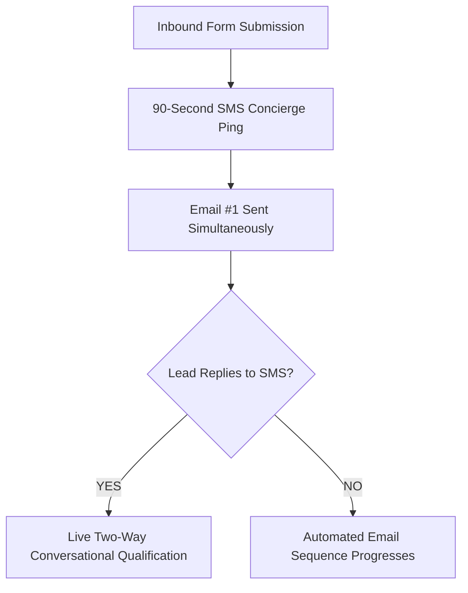

## Why 80% of Inbound Leads Never Buy (And How Nurture Solves It)

According to sales performance data across thousands of B2B companies and agencies:

* **3% to 5%** of your inbound leads are ready to buy immediately upon submitting a form.
* **15%** of leads will never buy no matter what you do (wrong fit, no budget, students, competitors).
* **80% to 82%** of leads intend to solve their problem within the next 3 to 12 months, but are not ready to sign a contract on day one.

Most sales teams treat inbound inquiries like a binary switch. 

If a prospect doesn't book a call within 48 hours, sales reps mark the lead as "unresponsive" and abandon them forever. They dump thousands of dollars into Facebook Ads, Google Search, and cold outreach with [Audnix AI](https://audnix.ai) to acquire new leads, while allowing an enormous pool of warm prospects to freeze in their CRM.

The companies that dominate their category don't just rely on first-touch closes. They build an **automated lead nurture engine** that maintains top-of-mind relevance, dismantles skepticism, and converts "maybe later" into signed retainers.

Here is the exact 7-part sequence you can deploy today.

---

## The 7-Touch Multi-Channel Nurture Architecture

Effective nurturing in 2026 is **not** sending a generic monthly company newsletter with blog links. It is a calculated sequence of short, value-dense messages engineered to trigger curiosity, demonstrate proof, and make scheduling a conversation frictionless.

```
Touch 1 (Day 0 - Min 2):  The Frictionless Asset Delivery
Touch 2 (Day 1 - 24 hrs): The Counter-Intuitive Truth (Belief Shift)
Touch 3 (Day 3):          The Specific Metric Teardown (Case Study)
Touch 4 (Day 5):          The Objection Dismantler (Risk Inversion)
Touch 5 (Day 8):          The "Behind the Curtain" Loom / System Teardown
Touch 6 (Day 12):         The Trigger Event / Industry Shift
Touch 7 (Day 16):         The Graceful "Have You Given Up?" Breakup
```

---

## The 7 High-Converting Email Templates (With Copy-Paste Swipes)

### Email #1: The Instant Asset Delivery & Micro-Question
* **Timing:** Under 90 seconds after form submission.
* **Objective:** Confirm delivery, establish personal dialogue, and encourage an immediate micro-reply.

```text
Subject: Here is the [Asset/Blueprint Name] (+ quick question)

Hey [First Name],

Here is the direct link to the [Asset Name] you requested: 
[Direct Download Link - No Gate]

Most people who review this are looking to fix one of two things:
1. Inbound leads slipping through the cracks due to slow follow-up latency
2. Scaling outbound client acquisition without hiring a 5-person SDR team

Which of those is the bigger focus for [Company Name] right now? 

Just reply 1 or 2 — I read every response.

Best,
[Your Name]
ReplyFlow Architecture Lead
```

### Email #2: The Counter-Intuitive Truth (Belief Shift)
* **Timing:** Day 1 (24 hours after opt-in).
* **Objective:** Shatter the conventional wisdom that is keeping them stuck and position your mechanism as the superior alternative.

```text
Subject: Why hiring another sales rep is a mistake in 2026

Hey [First Name],

When service businesses want to grow, their default instinct is usually: "Let's hire another SDR or sales rep."

Six months and $45,000 later, they discover the ugly math:
- Reps take 3 to 4 months to ramp up.
- Humans only work 8 hours a day, 5 days a week.
- Weekend and evening leads sit unanswered for 48+ hours.
- Human follow-up consistency drops by 70% after the second attempt.

The highest-performing teams in 2026 aren't adding human headcount to do repetitive follow-ups. They are deploying autonomous response engines like ReplyFlow to handle the 90-second response, qualification, and calendar booking around the clock.

If you are curious how that math compares to a traditional rep, here is our full breakdown:
[Link to: Will AI SDRs Replace Sales Reps in 2026?]

Are you currently handling inbound lead follow-up manually or with automation?

Best,
[Your Name]
```

### Email #3: The Specific Metric Teardown (Case Study Proof)
* **Timing:** Day 3.
* **Objective:** Prove measurable business outcomes with hyper-specific data rather than vague hype.

```text
Subject: How [Client Company] booked 34 extra demos in 21 days (without extra ad spend)

Hey [First Name],

A quick breakdown from last month:

[Client Name], an agency founder in the B2B space, was spending $6,000/month on Google Ads. They were generating around 40 inbound inquiries per month, but only booking 6 discovery calls.

A 15% booking rate.

We didn't touch their ad copy. We didn't change their landing page.

We implemented one single change: we cut their speed-to-lead response time from 3 hours down to 85 seconds using an autonomous multi-channel sequence.

The results after 21 days:
- Response rate jumped from 22% to 64%.
- Total booked discovery calls increased from 6 to 40.
- Show-up rate on calls reached 88%.

You can read the complete tactical teardown here:
[Link to: How to Increase Inbound Lead Conversion Rate]

Want to see how your current response time compares against industry benchmarks? Grab 10 minutes on my calendar here: [Calendly Link]

Best,
[Your Name]
```

### Email #4: The Objection Dismantler (Eliminating Fear of Complexity)
* **Timing:** Day 5.
* **Objective:** Address the unspoken fear that implementing your solution will take months or require complex technical overhauls.

```text
Subject: "How long does this take to set up?"

Hey [First Name],

The most common question founders ask us is: 
"Do we have to rebuild our entire CRM or hire developers to make this work?"

The short answer is no.

Modern revenue infrastructure should plug directly into what you already use: HubSpot, GoHighLevel, Slack, Calendly, or Stripe. In fact, our entire autonomous sales engine deploys in under 72 hours without disrupting your existing sales reps.

Here is what the 72-hour launch looks like:
- Day 1: Connect your inbound forms and CRM webhooks.
- Day 2: Calibrate custom conversational qualification prompts for your niche.
- Day 3: Test multi-channel delivery (SMS + Email) and switch to live autopilot.

If you have 15 minutes this week, I would love to show you how this looks with your current tech stack: [Calendar Booking Link]

Best,
[Your Name]
```

### Email #5: The "Behind the Curtain" System Teardown
* **Timing:** Day 8.
* **Objective:** Provide a transparent, high-value visual walkthrough that builds massive authority.

```text
Subject: 3-minute video: What happens when a lead submits a form at 11:30 PM

Hey [First Name],

I recorded a quick 3-minute video showing behind-the-scenes footage of our autonomous sales pipeline in action:

[Watch 3-Min Loom Walkthrough]

In the video, you will see:
1. How a lead who fills out a form late on a Sunday night receives an intelligent, personalized SMS in 45 seconds.
2. How the AI asks 2 qualification questions to verify budget and company size.
3. How the lead selects an available slot on the founder's Google Calendar without any human intervention.

If you don't have time to watch the whole video, no worries. Here is the written playbook:
[Link to: How to Automate Your Sales Process in 2026]

Best,
[Your Name]
```

### Email #6: The Trigger Event / Opportunity Cost
* **Timing:** Day 12.
* **Objective:** Frame the cost of inaction. Show how every day of delay compounds revenue loss.

```text
Subject: The silent $10k/month leak in your pipeline

Hey [First Name],

Every month a company operates with slow follow-up times, they pay what we call the "latency tax."

If you generate 50 leads a month with an average deal size of $3,000:
- Responding in 2 hours = ~10% conversion = 5 deals = $15,000
- Responding in 90 seconds = ~25% conversion = 12 deals = $36,000

That is a $21,000 difference every single month from the exact same traffic.

You don't need more ad spend. You just need to capture the value you are already creating.

Ready to plug the leak? Let's talk for 15 minutes: [Calendar Booking Link]

Best,
[Your Name]
```

### Email #7: The Graceful "Have You Given Up?" Breakup
* **Timing:** Day 16.
* **Objective:** Trigger loss aversion. The Dean Jackson "Nine-Word Email" variant that routinely generates 40%+ reply rates.

```text
Subject: Have you given up on this?

Hey [First Name],

Have you given up on automating your inbound lead follow-up and scaling client acquisition for [Company Name]?

If your priorities have shifted, totally understand — I will stop following up.

If you are still interested but just got slammed with client delivery, grab a time when your schedule clears up: [Calendar Link]

Either way, rooting for your success!

Best,
[Your Name]
```

---

## How to Supercharge Email Nurture with SMS & WhatsApp

Relying exclusively on email nurture in 2026 is leaving money on the table. Average business email open rates hover between 18% and 24%, while SMS and WhatsApp open rates exceed **95%**.

By deploying [ReplyFlow](https://www.replyflow.pro), you can synchronize email with automated SMS:



When a prospect sees your SMS within 90 seconds, they recognize your name when Email #2 lands in their inbox the next morning. This multi-channel familiarity drives conversion rates up by **180%**.

---

## Action Plan to Launch Your Nurture System Today

1. Load these 7 templates into your CRM or marketing automation tool.
2. Insert your unique case study numbers and calendar booking links.
3. Connect [ReplyFlow](https://www.replyflow.pro) to ensure zero lead slips through the cracks during the initial 90 seconds.
4. If you have hundreds of old leads that ghosted you over the last 12 months, run our complete [Dead Lead Reactivation Campaign Guide](/blog/dead-lead-reactivation-campaign-guide) to generate an immediate cash injection.

---

### Related Growth Playbooks
* [The Complete Agency Lead Nurture System for 2026](/blog/agency-lead-nurture-system-2026)
* [Dead Lead Reactivation Campaign Guide: Revive Cold Leads](/blog/dead-lead-reactivation-campaign-guide)
* [How to Recover Revenue from Dead Leads with AI Automation](/blog/dead-lead-recovery)
* [Cold Email + AI in 2026: The Complete Playbook](/blog/cold-email-ai-2026-complete-guide)
* [Inbound Lead Qualification Framework: How to Filter Tire-Kickers](/blog/inbound-lead-qualification-framework)

